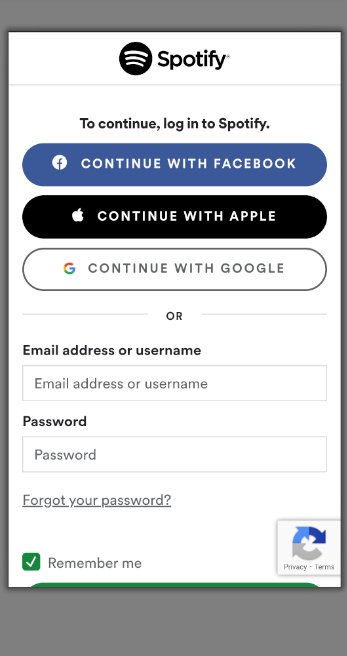
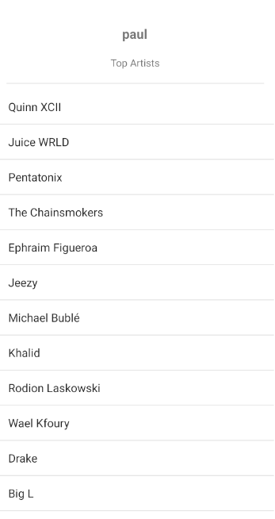
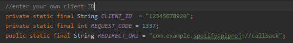
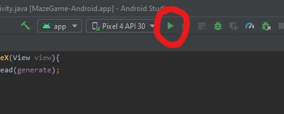

<h3>Technologies & skills</h3>

<ul>
  <li>Java</li>
  <li>Android Studio</li>
  <li>Gradle</li>
  <li>Spotify API</li>
  <li>Volley</li>
</ul> 

<h3>Introduction</h3>

The goal of this project was to simply connect to an API, retrieve data from it, and display it in a listview. I used volley to make 
requests to the Spotify Web API. The steps I follow to connect can be found here :

https://developer.spotify.com/documentation/android/


<h3>What it looks like</h3>
 
You must have a spotify account to run this application. The application will authenticate the user through the spotify API. 



After a successful login, you should be directed to a page with the Users spotify name on top and a listview of thier top artists. 



<h3>How to Run</h3> 

Make sure you have Android Studio installed and some type of emulator to test to program. 

```
git clone https://github.com/PaulCardoos/Artists-Data-Spotify-API-Android.git
```
When you open the project in Android Studio it should fail to automatically build. You need to go to the developers portal in spotify and 
retrieve your client ID. The client ID then needs to be inserted into the AuthenticationActivity class. You can use the image below as a reference.



Now the application should successfully build.

Next, just click the play button on your app and your emulator should load and run the app. For reference look at the image below



Any questions feel free to contact me at paul.cardoos@outlook.com

<h3>Extras</h3>
Obviously, style is not the goal on this project

**(side note)** I am using a Pixel 4 x86 11GB Disk API 30 on Android 11.0 (google play). 
